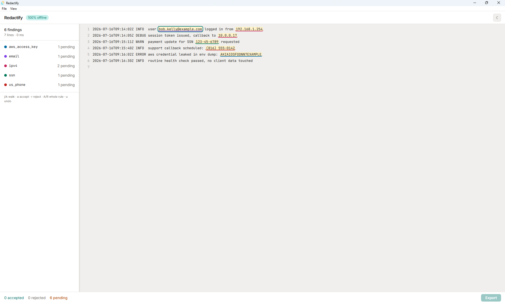
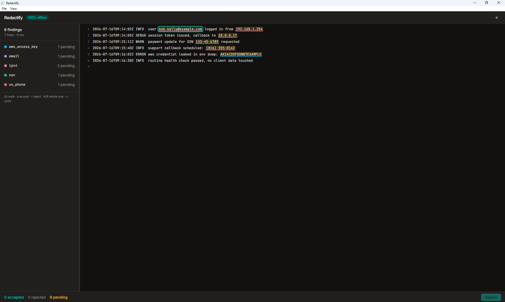

# Redactify

[](https://github.com/garykellygrimm-a11y/Redactify/actions/workflows/ci.yml)
[](LICENSE)

**Redaction you can prove.** Redactify finds sensitive data — PII and
secrets — in text files, puts a human in the loop to review every
finding, and produces sanitized output alongside a cryptographically
verifiable audit manifest. It runs entirely offline: no cloud, no ML
model downloads, no telemetry. Your files never leave your machine.

A Rust detection engine serves two frontends: a desktop review app
(Tauri + React + TypeScript) and a CLI.



## Download

Installers and binaries for the latest release are on the
[releases page](https://github.com/garykellygrimm-a11y/Redactify/releases/latest).

| Platform | Desktop app | CLI |
| --- | --- | --- |
| Windows | `.exe` installer or `.msi` | `redactify-cli-windows-x64.zip` |
| macOS | `.dmg` (universal) | `redactify-cli-macos-arm64.tar.gz` |
| Linux | `.AppImage`, `.deb`, or `.rpm` | `redactify-cli-linux-x64.tar.gz` |

Builds are unsigned. Windows SmartScreen will warn — choose "More info" then
"Run anyway". macOS may report the app as damaged; right-click it and choose
Open, or run `xattr -d com.apple.quarantine`. AppImages need `chmod +x`
before they will run.

Every CLI archive ships a `.sha256` sidecar. Verifying a download before you
run it is good practice generally, and fitting for this tool in particular.
Releases are currently verified manually on Windows only; the macOS and Linux
artifacts are built by CI. Issue reports are welcome.

## Why another redaction tool?

Existing tools are fire-and-forget: text in, redacted text out, hope
for the best. Redactify is built around two ideas the ecosystem
underserves:

1. **Human-in-the-loop review.** Automated detection produces false
   positives. Redactify proposes; a person disposes — every finding is
   explicitly accepted or rejected before anything is written, with
   the export gate refusing to run until the review is complete.
2. **Provable redaction.** Every export writes an audit manifest
   recording what was detected, what a reviewer accepted or rejected,
   and SHA-256 hashes of the source and output. Anyone holding the
   original can verify the entire chain with standard tools; anyone
   holding only the manifest learns nothing sensitive.

Fully offline, deterministic operation is a design constraint, not an
afterthought — Redactify is built to work in air-gapped and restricted
environments.

## The desktop app

Open a file three ways (drag-and-drop, Browse, or File → Open), review
findings in a keyboard-driven three-zone interface, and export when
every finding is decided. A 30,000-line log with 30,000 findings scans
in under 200 ms.

| Key | Action |
| --- | --- |
| `↑` / `↓` | Walk findings (document auto-scrolls) |
| `a` / `r` | Accept / reject the focused finding, advance |
| `Shift+A` / `Shift+R` | Accept / reject every pending finding of the rule |
| `Ctrl+Z` | Undo the last decision (repeat to walk back) |
| `Ctrl+F` | Search the document |
| `Ctrl+D` | Toggle before/after output preview |
| `Ctrl+S` | Save (reuses the last export destination this session) |
| `Ctrl+E` | Export (always asks where to save) |
| `Ctrl+O` / `Ctrl+L` / `Ctrl+W` | Open file / load rules / close document |

Accepted findings render in place as `[REDACTED:rule]` tokens, so the
document view is a live preview of the output. Light and dark themes,
resizable layout, window-state persistence, and confirmation before
any in-progress review can be discarded.



## The audit manifest

Exports write `{name}.manifest.json` beside the redacted file:

- SHA-256 of the complete source and complete output
- Every finding detected — rule, byte span, length, and its
  **disposition**: `accepted` (redacted) or `rejected` (a reviewer saw
  it and declined)
- The active rule set, tool version, and UTC timestamp
- No matched content and no per-finding hashes, ever — see
  [ADR 001](docs/adr/001-manifest-content.md) for why unsalted hashes
  of low-entropy data are obfuscation, not protection

Verification requires nothing but coreutils: `sha256sum` of your
original and the export must match the manifest.

## The CLI

```console
$ redactify input.log -o clean.log --manifest audit.json
6 findings: 1 aws_access_key, 1 email, 2 ipv4, 1 ssn, 1 us_phone
```

Sanitized output to stdout (or `-o`), summary to stderr, so shell
redirection captures clean content only. CLI manifests mark every
finding `accepted` — truthfully, since no human review occurred.

## Detection rules

Twenty-one builtin rules: email, IPv4, IPv6, US SSN, US phone, AWS access
key ID, GCP API key, GCP OAuth client ID, Oracle Cloud Identifier (OCID),
Azure SAS token, a generic PEM private-key block (covers leaked keys from
AWS, GCP, Oracle, and plain SSH with one rule), Stripe API key,
DigitalOcean API token, SendGrid API key, GitHub token (classic and
fine-grained), Slack token, HashiCorp Vault token, OpenAI API key,
Anthropic API key, npm access token, and Twilio SID.
Add your own in TOML (`--rules` in the CLI, File → Load Rules in the
app; same-id rules override builtins):

```toml
[[rules]]
id = "cui_marker"
name = "CUI Banner Marking"
pattern = '(?i)\bCUI//[A-Z]+\b'
```

Validation is fail-fast: any invalid pattern aborts the entire load
with the offending rule named — a partially-applied rule set would
produce output you wrongly believe is fully redacted
([ADR 002](docs/adr/002-user-rules.md)). Rust's regex engine is
linear-time by construction, so hostile patterns can't ReDoS; a
compile-size cap closes the remaining memory vector.

## Building from source

Requires the [Rust toolchain](https://rustup.rs/) and, for the app,
[Node.js](https://nodejs.org/).

```console
$ git clone https://github.com/garykellygrimm-a11y/Redactify.git
$ cd Redactify
$ cargo build --release            # engine + CLI
$ cd app && npm install && npm run tauri dev   # desktop app
```

`cargo test` runs the suite.

## Architecture

Cargo workspace, strict core/frontend split:

```
crates/
├── redactify-core/   # detection, rules, redaction, manifest — pure
│                     # library, no I/O opinions
└── redactify-cli/    # thin frontend over the core
app/
├── src-tauri/        # Rust: commands, session state, native menus
└── src/              # React/TypeScript: review UI only
```

Design decisions worth noting:

- **The frontend never does offset math.** Findings are UTF-8 byte
  offsets; JS strings are UTF-16. Rust pre-segments every line into
  render-ready spans, so highlight misalignment on non-ASCII input is
  impossible by construction.
- **Review state is an event log.** Decisions append; state derives by
  replay. Undo pops the log, and rule-wide sweeps record as one event
  so a single undo reverses them. Bulk actions only touch *pending*
  findings — they never overwrite individual judgments.
- **The engine owns truth.** Open documents live in Rust-side state;
  the UI holds display segments and verdicts, and export round-trips
  only decisions — never document content.
- **Liberal matching, by policy.** Rules favor recall; false positives
  are acceptable because a human reviews every finding. That is the
  product, not a bug.

## Roadmap

Shipped:

- ✅ **M0** — Workspace, CI (fmt / clippy / test), branch policy
- ✅ **M1** — Detection engine, builtin rules, overlap resolution, CLI
- ✅ **M2** — Audit manifest (JSON), `Result`-based errors, `clap` CLI
- ✅ **M3** — User-defined rules (TOML, fail-fast validation)
- ✅ **M4** — Desktop app: review UI, export, custom rules, themes
- ✅ **M5** — Installers and binary releases for Windows, macOS, and Linux

Planned:

- ⬜ **v0.5 — Loose ends.** Virtualized document rendering for very large
  files, a recent files menu, refinement of the before/after preview, and a
  second attempt at automated version bumps and changelog generation.
- ⬜ **v0.6 — Verification.** A `redactify verify` command that takes an
  original file, its redacted output, and the manifest, and confirms the
  chain: hashes match, every finding is accounted for, nothing was altered
  after the fact. Plus batch processing and additional builtin rules —
  Luhn-validated card numbers, IPv6, more cloud credential formats.
- ⬜ **v0.7 — Rule authoring in the app.** A rule editor with live match
  highlighting against the open document, a block-based builder for people
  who would rather not write regex by hand, and select-to-suggest: highlight
  an example in your file, get ranked candidate patterns with match counts,
  and pick one. Rules are written to the same TOML the CLI reads, so nothing
  authored in the app is trapped there.
- ⬜ **v0.8 — Signed and self-updating.** Code-signed builds, in-app updates,
  and distribution through winget and Homebrew.
- ⬜ **v1.0 — Documents.** PDF and DOCX support, with redaction that removes
  content rather than drawing rectangles over it — the failure mode that
  leaks names out of "redacted" filings with some regularity.

## A note from the author

Redactify started as a PowerShell log-scrubbing module at work, which I later
rewrote as a Python CLI. This project began as a rebuild of that idea from
scratch — a different language, a different architecture, and a much larger
scope — mostly as a way to get real practice with Rust and with building a
desktop application end to end. It grew from there into what's now in this
repository.

This is my very first public project. Feedback, questions, and issues are welcome
— see [CONTRIBUTING.md](CONTRIBUTING.md) if you'd like to get involved.

## License

MIT — see [LICENSE](LICENSE).
