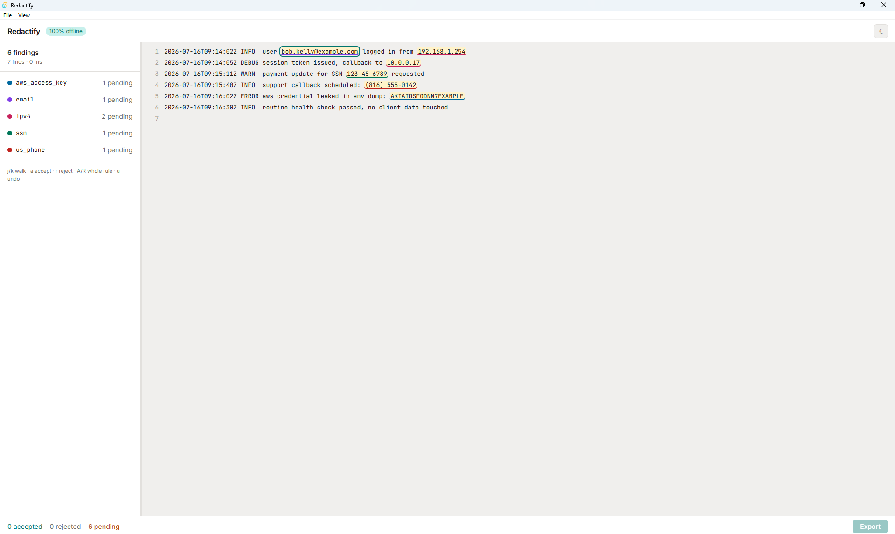

# Redactify

[](https://github.com/garykellygrimm-a11y/Redactify/actions/workflows/ci.yml)
[](https://github.com/garykellygrimm-a11y/Redactify/releases/latest)
[](LICENSE)

**Redaction you can prove.** Redactify finds sensitive data — PII and
secrets — in text files, puts a human in the loop to review every finding,
and produces sanitized output alongside a verifiable audit manifest. It runs
entirely offline: no cloud, no ML model downloads, no telemetry. Your files
never leave your machine.

A Rust detection engine serves two front ends: a desktop review app and a
command-line tool.



## Why another redaction tool?

Most redaction tools are fire-and-forget: text in, redacted text out, and hope
for the best. Redactify is built around two ideas:

1. **Human-in-the-loop review.** Automated detection produces false
   positives. Redactify proposes; a person decides. Every finding is accepted
   or rejected before anything is written.
2. **Provable redaction.** Every export writes an audit manifest recording
   what was detected, what the reviewer decided, and SHA-256 hashes of the
   original and the output. Anyone holding the original can verify the whole
   chain with standard tools; anyone holding only the manifest learns nothing
   sensitive.

Fully offline, deterministic operation is a design constraint, not an
afterthought. Redactify is built for air-gapped and restricted environments.

## Download

Installers and binaries for the latest release are on the
[releases page](https://github.com/garykellygrimm-a11y/Redactify/releases/latest).

| Platform | Desktop app | CLI |
| --- | --- | --- |
| Windows | `.exe` installer or `.msi` | `redactify-cli-windows-x64.zip` |
| macOS | `.dmg` (universal) | `redactify-cli-macos-arm64.tar.gz` |
| Linux | `.AppImage` or `.deb` | `redactify-cli-linux-x64.tar.gz` |

Builds are unsigned. Windows SmartScreen will warn: choose **More info**, then
**Run anyway**. macOS may report the app as damaged: right-click it and choose
**Open**, or run `xattr -d com.apple.quarantine`. AppImages need `chmod +x`
before they run.

Every CLI archive has a `.sha256` file beside it. Verifying a download before
running it is good practice, and especially fitting for this tool. Releases
are tested by hand on Windows; the macOS and Linux builds are produced by CI.

## Quick start

**Desktop app:** open a text file by dragging it onto the window. Review each
finding with `a` (accept, redact it) or `r` (reject, keep it), using `↑` and
`↓` to move between them. When none are pending, export with `Ctrl+E`. See the
[desktop app guide](docs/user-guide/desktop-app.md).

**CLI:**

```console
$ redactify-cli scan input.log -o clean.log --manifest clean.log.manifest.json
6 findings: 1 aws_access_key, 1 email, 2 ipv4, 1 ssn, 1 us_phone

$ redactify-cli verify input.log --output clean.log --manifest clean.log.manifest.json
✓ source file matches manifest
✓ output file matches manifest
✓ every finding is accounted for (redaction reconstructs exactly)

verified: this manifest's account of what happened checks out.
```

See the [command-line guide](docs/user-guide/cli.md).

## Documentation

- [Desktop app](docs/user-guide/desktop-app.md) and
  [command line](docs/user-guide/cli.md)
- [Custom rules](docs/user-guide/custom-rules.md) for patterns specific to
  your organization
- [The audit manifest](docs/user-guide/audit-manifest.md) and how to verify
  a redaction
- [All 30 detection rules](docs/reference/detection-rules.md)
- [Roadmap](docs/roadmap.md)

The full documentation index is in [docs/](docs/README.md).

## Building from source

Requires the [Rust toolchain](https://rustup.rs/) and, for the desktop app,
[Node.js](https://nodejs.org/) 24. On Linux, building the workspace also needs
the system packages listed in Tauri's
[prerequisites](https://v2.tauri.app/start/prerequisites/#linux), because
`cargo build` includes the desktop app.

```console
$ git clone https://github.com/garykellygrimm-a11y/Redactify.git
$ cd Redactify
$ cargo build --release            # engine + CLI
$ cd app && npm ci && npm run tauri dev   # desktop app
```

To contribute, see [CONTRIBUTING.md](CONTRIBUTING.md).

## A note from the author

Redactify started as a PowerShell log-scrubbing module at work, which I later
rewrote as a Python CLI. This project began as a rebuild of that idea from
scratch — a different language, a different architecture, and a much larger
scope — mostly as a way to get real practice with Rust and with building a
desktop application end to end. It grew from there into what's now in this
repository.

This is my very first public project. Feedback, questions, and issues are
welcome — see [CONTRIBUTING.md](CONTRIBUTING.md) if you'd like to get
involved.

## License

MIT — see [LICENSE](LICENSE).
